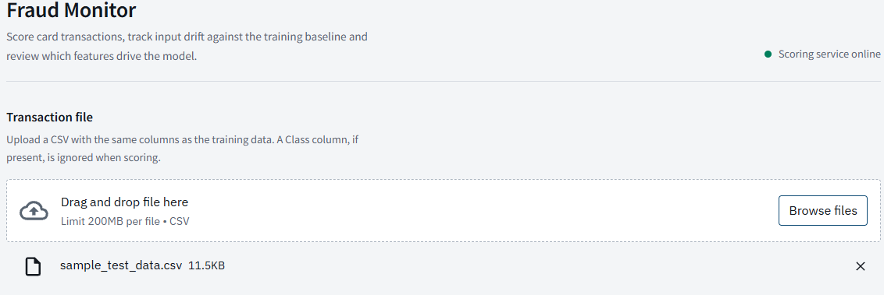
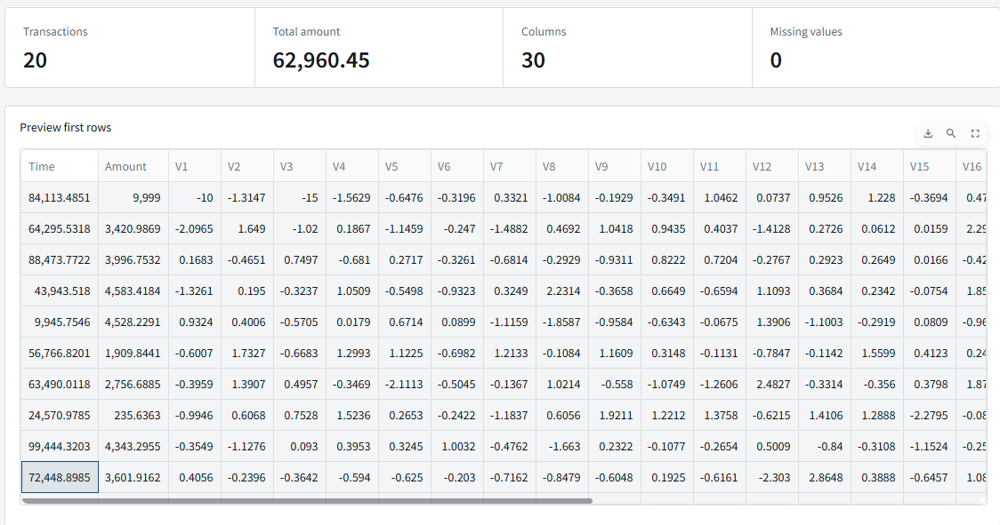
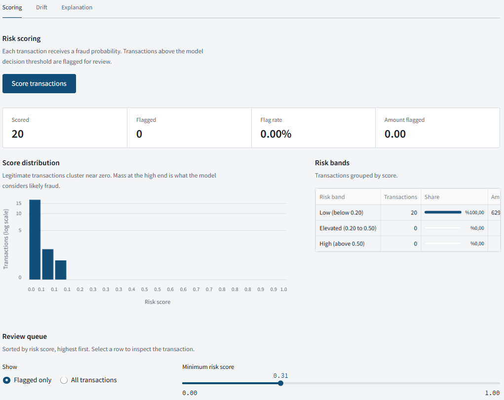
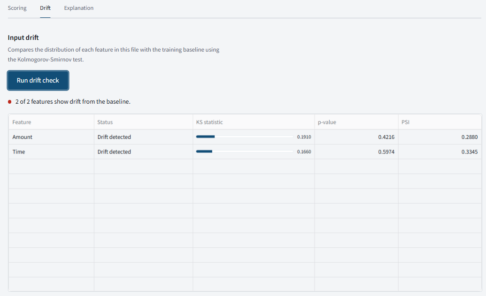

# Fraud Detection System

End to end credit card fraud detection platform. It trains an XGBoost classifier on imbalanced transaction data, serves predictions through a secured REST API, stores every scored transaction in PostgreSQL, monitors input drift and gives risk analysts a dashboard to review flagged transactions.

## Contents

- Architecture
- Technology stack
- Services
- Getting started
- Configuration
- API reference
- Dashboard
- Model lifecycle
- Testing and CI
- Development workflow
- Results

## Architecture

```
                 +--------------------+
  CSV / client   |     dashboard      |
  ------------>  |   Streamlit 8501   |
                 +---------+----------+
                           |  X-API-Key
                           v
                 +--------------------+        +--------------------+
                 |        api         | -----> |         db         |
                 |   FastAPI 8000     |        |  PostgreSQL 5432   |
                 +----+----------+----+        +--------------------+
                      |          |
          load model  |          |  track runs
                      v          v
            +-----------+    +-----------+
            |   minio   |    |  mlflow   |
            | S3  9000  |    |   5000    |
            +-----------+    +-----------+
```

The API loads the active model from MinIO, scores transactions, writes the results to PostgreSQL and exposes drift and retraining operations. Training runs log parameters, metrics and artifacts to MLflow and upload the resulting model to MinIO. Drift and retraining events can notify a Slack channel through a webhook.

## Technology stack

| Area | Tools |
| --- | --- |
| Machine learning | XGBoost, Optuna, SMOTE (imbalanced-learn), SHAP |
| Backend | FastAPI, Uvicorn, SQLAlchemy |
| Frontend | Streamlit, Altair |
| Storage | PostgreSQL, MinIO (S3 compatible, accessed with boto3) |
| MLOps | MLflow, Docker, Docker Compose |

## Services

| Service | Purpose | Port |
| --- | --- | --- |
| api | FastAPI application serving predictions, drift checks and retraining | 8000 |
| dashboard | Streamlit interface for the risk team | 8501 |
| mlflow | Experiment tracking and model registry | 5000 |
| db | PostgreSQL database storing scored transactions | 5432 |
| minio | S3 compatible storage holding trained model artifacts | 9000 |

## Repository layout

```
.
├── api/
│   └── main.py              API endpoints and API key validation
├── dashboard/
│   └── app.py               Streamlit review interface
├── src/
│   ├── train_pipeline.py    Optuna tuning, SMOTE, training, MLflow logging, MinIO upload
│   ├── predict.py           Model loading and scoring
│   ├── db.py                SQLAlchemy persistence layer
│   ├── drift.py             Kolmogorov-Smirnov drift detection
│   └── alert.py             Slack webhook notifications
├── tests/
├── .streamlit/
│   └── config.toml          Dashboard theme
├── docker-compose.yml
├── Dockerfile
└── requirements.txt
```

## Getting started

Requirements: Docker with Docker Compose, and the Kaggle credit card fraud dataset placed at `data/creditcard.csv`.

Start every service:

```
docker compose up --build
```

Then open:

- Dashboard: http://localhost:8501
- API documentation: http://localhost:8000/docs
- MLflow: http://localhost:5000
- MinIO API: http://localhost:9000

Train the first model before scoring transactions:

```
docker compose exec api python -m src.train_pipeline
```

Local development without Docker:

```
python -m venv venv
source venv/bin/activate
pip install -r requirements.txt
uvicorn api.main:app --reload
streamlit run dashboard/app.py
```

Run the dashboard from the repository root so that `.streamlit/config.toml` is picked up.

## Configuration

Values are read from environment variables. Set them in `docker-compose.yml` or an `.env` file that is excluded from version control.

| Variable | Used by | Description |
| --- | --- | --- |
| API_URL | dashboard | Base URL of the API, default `http://api:8000` |
| API_KEY | dashboard, api | Key sent in the `X-API-Key` header and checked by the API |
| REPORT_DIR | dashboard | Directory containing SHAP figures, default `reports` |
| DATABASE_URL | api | PostgreSQL connection string |
| MLFLOW_TRACKING_URI | api, training | MLflow server address |
| MINIO_ENDPOINT | api, training | MinIO address |
| MINIO_ACCESS_KEY | api, training | MinIO access key |
| MINIO_SECRET_KEY | api, training | MinIO secret key |
| SLACK_WEBHOOK_URL | api | Optional webhook for drift and retraining alerts |

Never commit real keys or webhook URLs.

## API reference

Every endpoint requires the `X-API-Key` header. Requests without a valid key are rejected.

| Method | Path | Description |
| --- | --- | --- |
| GET | /health | Service status |
| POST | /predict/single | Real time prediction for one transaction |
| POST | /predict/batch | Predictions for a list of transactions |
| POST | /drift | Drift report against the training baseline |
| POST | /retrain | Starts retraining in the background |

Single prediction:

```
curl -X POST http://localhost:8000/predict/single \
  -H "Content-Type: application/json" \
  -H "X-API-Key: $API_KEY" \
  -d '{"Time": 0.0, "Amount": 100.0, "V1": 0.0, "V2": 0.0, "V3": 0.0, "V4": 0.0, "V5": 0.0, "V6": 0.0, "V7": 0.0, "V8": 0.0, "V9": 0.0, "V10": 0.0, "V11": 0.0, "V12": 0.0, "V13": 0.0, "V14": 0.0, "V15": 0.0, "V16": 0.0, "V17": 0.0, "V18": 0.0, "V19": 0.0, "V20": 0.0, "V21": 0.0, "V22": 0.0, "V23": 0.0, "V24": 0.0, "V25": 0.0, "V26": 0.0, "V27": 0.0, "V28": 0.0}'
```

Batch prediction response shape:

```
{"predictions": [{"prediction": 0, "probability": 0.0012}]}
```

Drift response shape:

```
{"report": {"V1": {"drift_detected": false, "ks_statistic": 0.04, "p_value": 0.61}}}
```

## Dashboard

The dashboard is built for analysts who review flagged transactions.

- Upload a CSV and score it through the batch endpoint.
- Review queue sorted by risk score, with a detail panel for the selected transaction.
- Risk bands, score distribution and the total amount flagged.
- Drift report per feature using the Kolmogorov-Smirnov statistic.
- SHAP figures for global importance and single prediction explanations.
- Service status indicator based on the health endpoint.






The interface uses IBM Plex Sans and a fixed light theme defined in `.streamlit/config.toml` and the dashboard stylesheet.

## Model lifecycle

1. Training splits the data with stratification, balances the training set with SMOTE and tunes XGBoost with Optuna, optimizing PR-AUC.
2. Parameters, metrics and artifacts are logged to MLflow.
3. The selected model is serialized with joblib and uploaded to MinIO.
4. The API loads the model from MinIO and scores incoming transactions, persisting each result to PostgreSQL.
5. The drift endpoint compares incoming data with the training distribution. When drift is detected, an alert can be sent to Slack.
6. The retrain endpoint repeats the training process in the background and publishes a new model.

Accuracy is not used for evaluation because of the class imbalance. Precision, recall, F1, ROC-AUC and PR-AUC are reported.

## Testing and CI

```
pytest
```

GitHub Actions installs dependencies and runs the test suite on every push and pull request.

## Development workflow

Work happens on feature branches. Each change is delivered as a pull request with Conventional Commits messages such as `feat:`, `fix:`, `chore:`, `test:` and `docs:`. Pull requests are merged into `main` after review.

Project conventions:

- No comments or docstrings in source files.
- No emoji in code, interface text, commit messages or pull request descriptions.
- Commit messages and pull request descriptions are written in English.

## Results

Fill this table with the values logged in MLflow for the selected model.

| Model | Sampler | Precision | Recall | F1 | PR-AUC |
| --- | --- | --- | --- | --- | --- |
| XGBoost | SMOTE | 0.94 | 0.82 | 0.88 | 0.89 |
